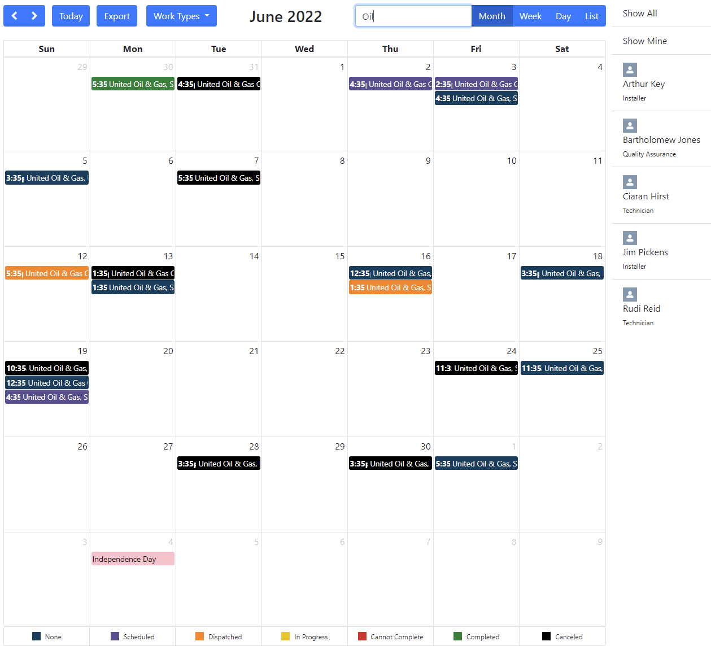

# Field Service Lightning (FSL) Resource Calendar

This calendar allows you to view service appointments (and resource absences) in your org.

You can filter by [Work Type](https://developer.salesforce.com/docs/atlas.en-us.object_reference.meta/object_reference/sforce_api_objects_worktype.htm), [Service Resource](https://developer.salesforce.com/docs/atlas.en-us.object_reference.meta/object_reference/sforce_api_objects_serviceresource.htm), [Service Appointment Status](https://developer.salesforce.com/docs/atlas.en-us.object_reference.meta/object_reference/sforce_api_objects_serviceappointment.htm) and even search appointments!

Or you can use all filters at once! (see screenshots below)

You can even use this without the need for a "Dispatcher License".

# Prerequisites

* Enable Field Service in your org
* [Install the FSL managed package](https://fsl.secure.force.com/install)
* Grab my [Apex Core Utils](https://github.com/MJ12358/apex-core-utils) (CsvBuilder and HolidayUtil are necessary)
* Deploy using button below
* Assign the "Resource Calendar" permission set to anyone who needs access
* You _may_ have to adjust "Sharing Settings" to allow public read on "Work Type"

# Deploy

# Screenshots

## Filter by Work Type

## Filter by Service Resource

## Filter by Searching

## Or use all filters at once!

# Tests

| Class | Percent | Lines |
| ----- | ------- | ----- |
| ResourceCalendarController | 95% | 91/95 |